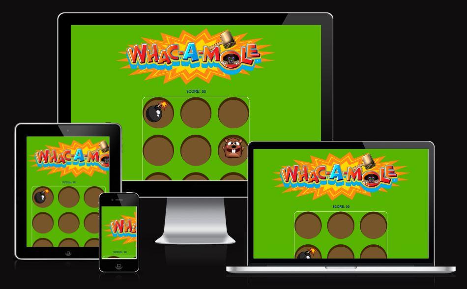

#Whac-A-Mole Mini-game

This is a whac-a-mole mini-game made with html, css and js using gitpod.

---
## CONTENTS

* [User Experience](#user-experience-ux)
  * [User Stories](#user-stories)

* [Design](#design)
  * [Colour Scheme](#colour-scheme)
  * [Typography](#typography)
  * [Imagery](#imagery)
  * [Wireframes](#wireframes)

* [Features](#features)
  * [General Features on Each Page](#general-features-on-each-page)
  * [Future Implementations](#future-implementations)
  * [Accessibility](#accessibility)

* [Technologies Used](#technologies-used)
  * [Languages Used](#languages-used)
  * [Frameworks, Libraries & Programs Used](#frameworks-libraries--programs-used)

* [Deployment & Local Development](#deployment--local-development)
  * [Deployment](#deployment)
  * [Local Development](#local-development)
    * [How to Fork](#how-to-fork)
    * [How to Clone](#how-to-clone)

* [Testing](#testing)

* [Credits](#credits)
  * [Code Used](#code-used)
  * [Content](#content)
  * [Media](#media)
  * [Acknowledgments](#acknowledgments)

---

## User Stories 

The content will not change as the game goes on in terms of elements, there will always be one mole and one bomb, with the same outcome happening when either is clicked. The goal of this game was primarily: 

###Create a unpredictable whac-a-mole game
The Java-script makes sure the 9 divs are chosen at random using a Math.floor(Math.random) * 9) function to make sure there is no pattern in the bomb and the mole placement.

## Design 

### Colour Scheme 

 

I chose this green colour as it wasn't too bright but I wanted something obviously resembling grass.

I chose this dirt as I felt it would contrast the green grass well and make it obvious to the user that this is a hole in the ground, I would later use a box shadow property I found on YouTube to make this hole seem to have deprth rather than just a 2-D hole.

Finally, I chose this as hexcol.com suggested it would be a good contrast, I tested this on WAVE and no contrast issues were found.

### Typography

I chose a Google Font for this called Caveat, I liked the rough and messy hand written style text for this project as if I were to design this project more I would have it based on a farm or in the OutBack like some of the Whac-A-Mole games I found online. 

### Imagery 

I chose one cartoon image for the mole and one for the bomb, the traditional royalty free Whac-A-Mole image was used for the h1 element instead of a written title.

### WireFrames

I made this wireframe using something called MockFlow https://mockflow.com/, I would use balsamiq usually but my trail ran out and I'm not sure how to get it working again.

## Features 

## General features of the page 

## Game Area

The page features a 3 by 3 grid of divs with css properties to make them look like holes. The mole and the bomb will move randomly for a set timer of 0.75 seconds(mole) and 1.5 seconds (bomb). Clicking on the bomb results in a game over displayed in the Score span. Clicking on the mole results in a +10 points being added to the score total.

## Score

The score span updates based on how often a mole is whacked or if the bomb is whacked. Clicking on the bomb results in a game over displayed in the Score span. Clicking on the mole results in a +10 points being added to the score total.