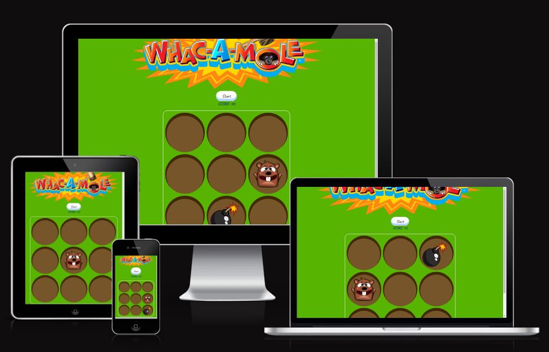
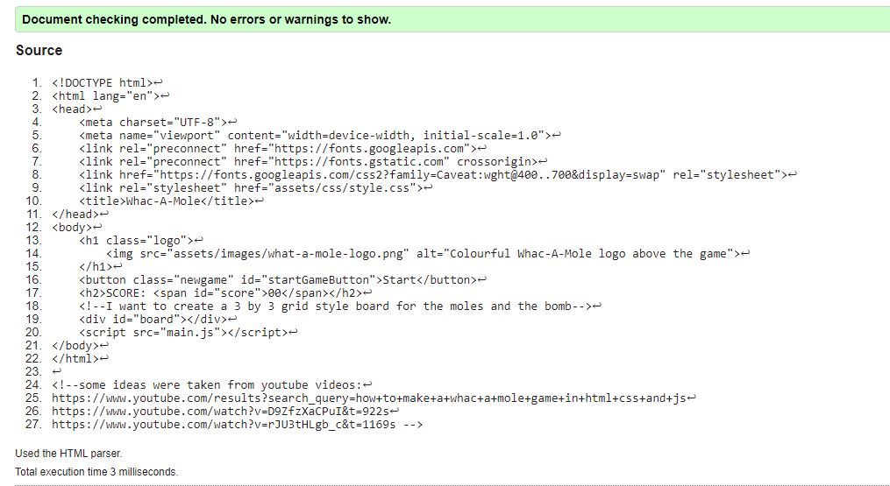

#Whac-A-Mole Mini-game

This is a whac-a-mole mini-game made with html, css and js using gitpod.

## Introduction

As a student I wanted to create something I would find more interesting for this project, I regularly play competitive computer games with friends and chose to create a Whac-a-Mole game using html, css and javascript. I wanted to create an unpredictable program that tests the user on how much score they can achieve in the minigame.

---
## CONTENTS

* [User Experience](#user-experience-ux)
  * [User Stories](#user-stories)

* [Design](#design)
  * [Colour Scheme](#colour-scheme)
  * [Typography](#typography)
  * [Imagery](#imagery)
  * [Wireframes](#wireframes)

* [Features](#features)
  * [General Features of the Page](#general-features-of-the-page)
  * [Future Implementations](#future-implementations)
  * [Accessibility](#accessibility)

* [Technologies Used](#technologies-used)
  * [Languages Used](#languages-used)
  * [Frameworks, Libraries & Programs Used](#frameworks-libraries--programs-used)

* [Deployment & Local Development](#deployment--local-development)
  * [Deployment](#deployment)
  * [Local Development](#local-development)
    * [How to Fork](#how-to-fork)
    * [How to Clone](#how-to-clone)

* [Testing](#testing)

* [Credits](#credits)
  * [Code Used](#code-used)
  * [Content](#content)
  * [Media](#media)

---

## User Stories 

As a developer I would like to be able to test my accuray and responsiveness to targets (moles) which give me points while avoiding other targets (bombs) which end the game, this is why the score feature exists, so that I can count how many successful targets I have clicked and bombs to end the game, the start button exists to start the game, restart the game once the game has ended due to bombs or to just restart if I feel like it.

### Create a unpredictable whac-a-mole game

The Java-script makes sure the 9 divs are chosen at random using a Math.floor(Math.random() * 9) function to make sure there is no pattern in the bomb and the mole placement.

## Design 

### Colour Scheme 

 

I chose this green colour as it wasn't too bright but I wanted something obviously resembling grass.

I chose this dirt as I felt it would contrast the green grass well and make it obvious to the user that this is a hole in the ground, I would later use a box shadow property I found on YouTube to make this hole seem to have deprth rather than just a 2-D hole.

Finally, I chose this as hexcol.com suggested it would be a good contrast, I tested this on WAVE and no contrast issues were found.

### Typography

I chose a Google Font for this called Caveat, I liked the rough and messy hand written style text for this project as if I were to design this project more I would have it based on a farm or in the OutBack like some of the Whac-A-Mole games I found online. 

### Imagery 

I chose one cartoon image for the mole and one for the bomb, the traditional royalty free Whac-A-Mole image was used for the h1 element instead of a written title.

### WireFrames

I made this wireframe using something called MockFlow https://mockflow.com/, I would use balsamiq usually but my trail ran out and I'm not sure how to get it working again.

## Features 

## General features of the page 

## Game Area

The page features a 3 by 3 grid of divs with css properties to make them look like holes. The mole and the bomb will move randomly for a set timer of 0.75 seconds(mole) and 1.5 seconds (bomb). Clicking on the bomb results in a game over displayed in the Score span. Clicking on the mole results in a +10 points being added to the score total.

## Score

The score span updates based on how often a mole is whacked or if the bomb is whacked. Clicking on the bomb results in a game over displayed in the Score span. Clicking on the mole results in a +10 points being added to the score total.

### Future Implementations

1. Alot can be done to improve a project like this, for example I could implement a image of a mallet and use it as a cursor in js. 

2. I would like to make it so more than one mole pops up at one time. Same for bombs.

3. Time limit for some difficulty.

4. Perhaps make the holes less symmetrical, adds more difficulty to the game.

5. Perhaps adding a more 3D look and theme to the game would be better some other examples I have found used outside famrs and had holes with uneven amounts of distanmce between them, this could add an element of difficulty.

### Accessibility

I have added alt tags where they are needed.

## Technologies Used

**Github** - Used for storage of my site and for publishing online.\
**GitPod** - The IDE used for editing my site and pushing changes.\
**HTML5** - The core of the site was built with HTML version 5.\
**CSS** - CSS was used to style the website and define fonts and layout.\
**Font Awesome** - Social Media icons from Font Awesome.\
**Google Chrome** - The website was built and tested in google Chrome.\
**Javascript** - The script in the body was made in js.

### Languages Used

HTML, CSS, Javascript

### Frameworks, Libraries & Programs Used

**Github** - I used GitHub for the storage of my site and Gitpages to pubish my website.\

## Deployment & Local Development

### Deployment

I deployed my page on git pages, using github I found my repository I wanted to deploy and went to settings, I amde sure my source was set to 'Deploy from Branch', main branch is selected and Folder is set to / (root). Then under Branch I clicked Save, after a few minutes I saw it live here: https://rourkew.github.io/Proj2/

### Local Development

#### How to Clone

1. Log onto GitHub.
2. Go to the repository of the Proj 2 Project RourkeW/Proj2/
3. Click the green code button and copy the preferred code link. 
4. Open the terminal in your chosen code editor and change the working directory to the location desired for the clone directory.
5. Type 'git clone' into the code terminal and paste the link from the green code button you copied earlier.

#### How to Fork

1. Log in to GitHub.
2. Find the repository for the Blue Skies Project RourkeW/Proj2/
3. Click Fork.

4. ## Testing

## Manual Testing

### Jigsaw CSS Validator

[Jigsaw]([https://jigsaw.w3.org/css-validator/validator](https://validator.w3.org/nu/)) was used to validate the HTML code

### W3C Validator

[W3C]([https://validator.w3.org/nu/](https://jigsaw.w3.org/css-validator/validator)) was used to verify the CSS.

### Jshint Validator

[Jshint](https://jshint.com/) was used to validate the JS.

### Wave Evaluation Tool

I used a Chrome extension my Merntor told me about called Wave to evaluate to page.

There is 1 error here in the sumamry it is for the lack of alt text in the java added image.

### Full Testing

Full testing was performed on the following devices:

* Desktop:
  * Windows 10 PX 
* Mobile Devices :
  * iPhone 13 PRO
 
  * Each device tested the site using the following browsers:

* Google Chrome
* Safari
* Opera GX

* ## Credits

I would like to thank my mentor Luke for being awesome as usual, his quickly theorised fixes helped me to make this project accessible. 

* ### Code Used

I got the project idea from just googling ideas for a javascript project, I also always wanted to make some kind of game since I have played games online my entire life. (https://www.freecodecamp.org/news/javascript-projects-for-beginners/)

Videos I used onjline to help me complete the js of this page are: 
(https://www.youtube.com/results?search_query=how+to+make+a+whac+a+mole+game+in+html+css+and+js)
(https://www.youtube.com/watch?v=D9ZfzXaCPuI&t=922s)
(https://www.youtube.com/watch?v=rJU3tHLgb_c&t=1169s)

### Media

I found the logo I used here: (https://www.deviantart.com/spdy4/art/Whac-A-Mole-Logo-Recreation-858122882)

I found the mole here (https://imgbin.com/png/mDH1BbQs/whac-a-mole-crappy-flappy-moles-android-video-game-png)

I found the bomb image here (https://www.rawpixel.com/search/bomb%20cartoon?page=1&path=_topics&sort=curated)

I found the favicon here (https://www.flaticon.com/free-icons/mole)

### Content 

I wrote all the content for this page, the 3x3 grid is common on all these videos and seemed common on any online version of Whac-A-Mole.
